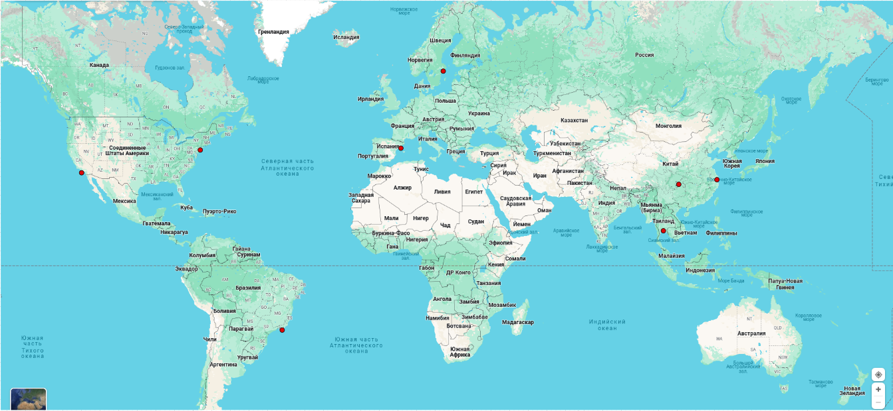

# Курсовая работа. Проект - Steam

## Содержание

### [Тема и целевая аудитория](#1)

### [Расчёт нагрузки](#2)

### [Глобальная балансировка нагрузки.](#3)

### [Локальная балансировка нагрузки.](#4)

### [Логическая схема базы данных.](#5)

### [Физическая схема базы данных.](#6)

## Тема и целевая аудитория 

В качестве высоконагруженной системы был выбран онлайн-сервис цифрового распростронения компьютерных игр и программ - Steam.

### Целевая Аудитория

#### Распределение по возрасту

Даннные со [statista](https://www.statista.com/forecasts/1242344/steam-us-user-share-by-age) сообщают о следующем распределении по возрасту в США:

| Возраст, лет| %  |
|-------------|----|
| 18-19       | 6  |
| 20-29       | 32 |
| 30-39       | 35 |
| 40-49       | 18 |
| 50-59       | 7  |
| 60-64       | 2  |

Можно принять то, что в остальных странах показатели схожи. Но стоит учитывать, то что несовершеннолетние пользователи намеренно меняют возраст, чтобы получить доступ к играм с возрастным ограничением. Учитывая этот факт, можно считать целевую аудиторию, начиная с 10 и до 50 лет.

Тот же источник ([statista](https://www.statista.com/forecasts/1242343/steam-us-user-share-by-gender)) сообщает о соотношении полов среди пользователей.

- Мужской - 68%
- Женский - 32%

Таким образом, можно сделать вывод о том, что средний пользователь Steam - это __мужчина около 30 лет__.

### Активность пользователей

В день: ≈ 25 млн активных пользователей

В месяц: ≈ 130 млн активных пользователей

Данные взяты с [steamdb](https://steamdb.info/app/753/charts/#1m) и [backlinko](https://backlinko.com/steam-users#:~:text=Steam%20has%20120%20million%20monthly,Steam%20on%20a%20daily%20basis.\\)

После математических рассчётов количества пользователей в разных странах, их соотношения относительно друг друга и пропорционального распределения относительно месячной активности, было получено:

- США - 16.7 млн
- Китай - 14 млн
- Россия - 11.6 млн
- Бразилия - 6 млн
- Германия - 4.4 млн
- Канада - 3.67 млн
- Турция - 3.42 млн
- Франция - 3.42 млн
- Великобритания - 3.18 млн
- Польша - 2.93 млн
- Филиппины - 2.57 млн
- Украина - 2.44 млн
- Япония - 1.95 млн
- Южная Корея - 1.83 млн
- Индонезия - 1.71 млн
- Австралия - 1.71 млн
- Аргентина - 1.59 млн
- Таиланд - 1.47 млн
- Испания - 1.47 млн
- Италия - 1.34 млн
- Румыния - 1.22 млн
- Мексика - 1.22 млн
- Чили  - 1.22 млн
- Индия - 1.18 млн
- Швеция - 1.16 млн
- Перу - 1 млн

Итого выходит MAU по континентам:

- Северная Америка - 21.59 млн
- Европа - 29.68 млн
- Азия - 31.61 млн
- Южная Америка - 9.81 млн
- Австралия - 1.59 млн

Данные стран, где пользователей меньше 1 млн в месяц не учитывались. Также стоит отметить, что в России 70% населения живут в европейской части страны, а 30% в азиатской. Было решено распределить пропорционально и самих пользователей.

Количество пользователей было взято из [worldpopulationview](https://worldpopulationreview.com/country-rankings/steam-users-by-country)

### Функционал

- Скачивание файлов игр с серверов Steam
- Нагрузки страниц игр
- Транзакции, связяанные с покупкой игр и операциями с банками
- Микротранзакции внутри игры, где Steam выступает посредником
- Рейтинг игр во внутреннем магазине

## Расчёт нагрузки 

Расчёт нагрузки будет осуществлён отдельно для каждого необходимого пути API.

### Расчёты

Как уже было сказано выше, данный об активных пользователях следующие:

- MAU - 130 млн
- DAU - 25 млн

Размер хранилища пользователя довольно невелик. В него включён список игр, количество часов в этих играх, дата последнего запуска каждой игры, список достижений, список друзей, аватар, 10 последних никнеймов и скриншоты.

Но размер этих данных несущественен по сравнению с тем фактом, что steam выделяет 1 ГБ на каждого пользователя для хранения его данных, скриншотов и некоторых настроек игр [источник](https://support.sega.com/hc/en-us/articles/9998624966161-How-much-space-does-my-Cloud-have-for-Football-Manager-files#:~:text=Steam%20allows%201GB%20of%20Cloud,use%20the%20Cloud%20Save%20Settings.). Выходит что размер хранилища на одного пользователя равен 1 ГБ.

#### Расчёт RPS

Поскольку найти количество скачиваемых игр в месяц не удалось, будем считать, что оно примерно равно среднему количеству покупок игр в месяц. Среднее количество покупок единиц игр в месяц равно 34.11 млн. Данные были взяты с сайта [statista](https://www.statista.com/statistics/1333058/steam-game-sales-units/#:~:text=Steam%20annual%20game%20units%20sold%202020%2D2028&text=First%20released%20in%202003%20by,platform%20(excluding%20free%20downloads).).

RPS на скачивание выходит  около 13. Однако стоит учитывать, что скачивание игр значительно отличается от обычного запроса. В данном случае упор делается на время, которое сервер выделяет для каждого пользователя. Оно зависит от интернет-соединения пользователя, а также от размера игры. Приняв тот факт, что игры скачивают почти всегда на постоянном интернете, скоростью около 100Мбит/с и средний размер игры, равный 15 ГБ ([источник](https://arstechnica.com/gaming/2013/09/is-downloadable-game-size-increasing-faster-than-broadband-speeds/#:~:text=On%20Steam%2C%20the%20average%20download,in%202007%20to%2015GB%20today.)).

Получим t = 15 \* 1024 \* 1024 \* 8 / (100 \* 1024) = 1228.8 секунд. t - среднее количество времени, которое сервер Steam удерживает соединение и отправляет данные одному пользователю.

RPS страницы игры. Будем высчитывать с помощью количества покупок. Известно, что коэффициент конверсии страницы игры (т.е. процент купленных игр относительно просмотра страницы) равен 6% для средней игры ([источник](https://www.gamesindustry.biz/dude-wheres-my-money-part-one-the-science-of-steam)).  

Следовательно, RPS = 34.11 млн / 0.06 / (30 * 86400) + 13 = 232.
Число 13 добавилось из учёта того, что 6% пользователей продолжают взаимодействие со страницей для покупки игры. Также стоит учесть, что 4 раза в год случаются распродажи, которые будут значительно увеличивать RPS на весь период распродаж. Количество просмотров в месяц отсюда же 568.5 млн.

RPS покупки игры опирался на [данное видео](https://www.youtube.com/watch?v=YJrWm83gVfw&ab_channel=GuideRealm), где показывается процесс покупки игры, который занимает, как минимум 5 запросов от каждого пользователя. Если брать данные о количестве покупок в месяц, то RPS = 34.11 млн \* 5 / (30 \* 86400) = 66. Тут также стоит учесть тот факт, что серверу необходимо дождаться результатов транзакции от банка, а также создать свою транзакцию и в случае ошибки на одном из этапов полностью откатить её и начать заново, иначе пользователь или Steam могут потерять деньги. Подробной информации о банковских операция Steam не была найдена, поскольку является коммерческой тайной. Однако стоит отметить такие технологии, как клиринг и облачные банковские хранилища позволяют облегчить нагрузку и сэконмить деньги. Клиринг - договор между компаниями о том, что они будут выплачивать друг другу не всю сумму, которую должны, а лишь разницу, накопленную за некоторое время. Такая технология позволяет вести журнал транзакций в течение дня и к концу дня перевести один крупный платёж, вместо многих маленьких. Благодаря электронному кошельку, Steam может менять баланс игроков после логических транзакций, а банковские транзакции совершить позже более крупным платежом. Облачные сервисы банков позволяют избавить Steam от траты ресурсов на вычисления банковских транзакций.

RPS пользования торговой площадкой Steam, которая также является посредником во внутриигровых микротранзакциях, вычислялся с помощью [данного видео](https://www.youtube.com/watch?v=pbzH4tTDyD0&ab_channel=Titan), которое показало, что для оформления покупки необходимо, как минимум 4 запроса. А также [данная статья](https://www.worldpay.com/en/insights/article/from-gaming-to-the-mainstream-are-microtransactions-here-to-stay), в которой говорится, что 41% пользвателей совершает как минимум одну внутригровую покупку в неделю. Для учёта тех, кто покупает больше, будем считать 1.5. Число запросов тороговой площадки для просмотра будем учитывать также из коэффициент конверсии, указанного выше (другой информации не было найдено). Также стоит учесть, что постоянно идёт выкладывание новых товаров на продажу, что также создаёт нагрузку. Будем считать количество этих выкладываний примерно равным покупкам. [Данное видео](https://www.youtube.com/watch?v=LYSbRrM_QIk&ab_channel=Titan) показывает, что для продажи предмета необходимо сделать 2 запроса. Итого получается С = 132млн \* 1.5 \* 0.41 \* 7  / (30 \* 86400) = 140, где C - количество покупок в секунду. RPS = 140 \* 4 + 140 / 0.06 + 140 \* 2 = 848. Здесь были сложены запросы за покупку, за просмотры и за выставление на продажу товаров. Стоит также учитывать, что как и в случае с покупкой игры, в данном случае необходимо соблюдать транзакционность и ждать ответа банка. В случае ошибки необходимо всё откатить и начать заново. Из сказанного выше количество покупок и продаж в месяц, т.е. единиц действия микротранзакций будет равно 730.62 млн.

RPS рейтинга рассчитывался на основе [данной статьи](https://app2top.ru/marketing/pochemu-pervy-e-10-otzy-vov-v-steam-samy-e-vazhny-e-dlya-vidimosti-igry-195815.html#:~:text=%D0%92%20%D1%81%D1%80%D0%B5%D0%B4%D0%BD%D0%B5%D0%BC%20%D0%BE%D0%B4%D0%B8%D0%BD%20%D0%BE%D1%82%D0%B7%D1%8B%D0%B2%20%D0%BE%D1%81%D1%82%D0%B0%D0%B2%D0%BB%D1%8F%D0%B5%D1%82,%D0%BF%D0%BE%D0%BB%D1%8C%D0%B7%D0%BE%D0%B2%D0%B0%D1%82%D0%B5%D0%BB%D1%8F%D0%BC%20%D0%B2%20%D0%BE%D0%B1%D0%BC%D0%B5%D0%BD%20%D0%BD%D0%B0%20%D0%BE%D1%82%D0%B7%D1%8B%D0%B2%D1%8B.), где говорится, что оценку делает каждый 30-й покупатель. При этом необходимо учесть, что за оценками идёт запрос при каждой загрузке страницы игры. итого получается RPS = 34.11 млн / 0.06 / (30 \* 86400) + 34.11 млн / 30 / (30 \* 86400) = 220. Из сказанного выше, количество просмотра и рейтинга и оценивания игр будет равно 35.25 млн.

### Продуктовые метрики

| Метрика                                    | Значение          |
|--------------------------------------------|-------------------|
| MAU                                        | 132 млн           |
| DAU                                        | 25 млн            |
| Скачивание игр                             | 34.11 млн/мес     |
| Посещение страницы игры                    | 568.5 млн/мес     |
| Покупка игр                                | 34.11 млн/мес     |
| Микротранзакции в играх, покупки и продажи | 730.62 млн/мес    |
| Рейтинг, просмотр и  оценивание            | 35.25 млн/мес     |

### Технические метрики

Количество игр в Steam равно 50046, [источник](https://earthweb.com/how-many-games-are-on-steam/#:~:text=As%20of%20the%20latest%20inventory,simulation%2C%20sports%2C%20and%20strategy.). Из источников выше можно также узнать, что в 2007 средний объём игр был равен 4 ГБ, а в 2023 - 15ГБ. Возьмём среднее значение - 10 ГБ для каждой игры. Итого выходит, что только для хранения файлов игры необходимо 500.46 ТБ. Каждому пользователю также необходим 1 ГБ памяти, как было сказано выше. [Данный источник](https://www.tomshardware.com/news/valve-steam-number-accounts-users-billion,39228.html#:~:text=More%20than%201%20billion%20Steam,exactly%20popping%20the%20champagne%2C%20however.) сообщает, что в Steam около 1 млрд аккаунтов, для каждого из которых выделен 1 ГБ памяти, т.е. для их хранения необходимо около 950 ПБ.

Остальной функционал не требует хранилищ таких объёмов.

Рассчитаем сетевой трафик.

__Скачивание__: Как было указано выше, длительность скачивания при скорости 100 Мбит/с равна примерно 1228.8 сек.
RPS на скачивание игры равен 13, а значит каждую секунду 13 новых человек начинают скачивание. Из этого выходит, что 13 \* 100 \* 1228.8 = 1.6Тб/сек - потребление трафика на скачивание игр.

__Страница игры__: По результатам открытия нескольких страниц с карточками игр и отключенным кэшэм, было выяснено, что средний размер страницы игры 40 МБ. Однако часть такой страницы (стили, js и лого компании), не относятся к функционалу страницы игры, поэтому не будут учтены. Посчитав размер данных, которые идут только с api "/steam/apps/", было получено в среднем 25.31 МБ. Следовательно, 232 * 25.31 = 5.87ГБ/сек = 46.98 Гб/сек.

__Покупка игры__: При покупке игры, происходит 4 запроса, каждый из которых за разными страницами, но они не содержат много изображений и каждая из них весит около 10 МБ. Поэтому суммарный трафик будет 4 \* 10 \* 66 = 21.12 Гб/сек. Банковский трафик не учтён.

__Внутриигровые микротранзакции__:
Одна страница торговой площадки весит около 500КБ, офомрление заказа ещё 1 МБ, расчитаем трафик 140 \* 0.5 + 1 \* 280 = 350 МБ/сек = 2.6 Гб/сек

__Рейтинг__ Загружается вместе со страницей карточки игры. Оценивание игры не несёт существенной нагрузки на трафик.

### Итого

Поскольку, найти данные о пиковых нагрузках Steam в сезоны распродаж найти не удалось, будем использовать данные о нагрузках на маркетплейсы в сезоны распродаж, чёрных пятниц и 11.11. [Данный источник](https://secrets.tinkoff.ru/blogi-kompanij/vysokij-sezon-na-marketplejsah/) сообщает, что нагрузки в такие дни вырастают в 7-8 раз. Примем для Steam число 7.

#### Трафик

| Запрос                                     | Потребляемый трафик (средний) | Потребляемый трафик (пиковый)  |
|--------------------------------------------|-------------------------------|--------------------------------|
| Скачивание игр                             | 1.6 Тб/сек                    | 11.2 Тб/сек                    |
| Посещение страницы игры                    | 46.98 Гб/сек                  | 329 Гб/сек                     |
| Покупка игр                                | 21.12 Гб/сек                  | 148.84 Гб/сек                  |
| Микротранзакции в играх, покупки и продажи | 2.6 Гб/сек                    | 18.2 Гб/сек                    |
| Рейтинг, просмотр и  оценивание            | вместе со страницей игры      | вместе со страницей игры       |

#### RPS

Примем пиковый RPS, равным увеличенному в 7 раз среднему.

| Запрос                                     | RPS (средний) | RPS (пиковый)|
|--------------------------------------------|---------------|--------------|
| Скачивание игр                             | 13            | 91           |
| Посещение страницы игры                    | 232           | 1624         |
| Покупка игр                                | 66            | 462          |
| Микротранзакции в играх, покупки и продажи | 848           | 5936         |
| Рейтинг, просмотр и  оценивание            | 220           | 1540         |

#### Хранилище

Из раздела "Технические метрики" можно сделать вывод, что больше всего памяти занимают облачные аккаунты пользоваетелей ~950 ПБ. Игры занимают 500 ТБ, а остальные данные не так значительны по сравнению с этими объёмами. Учитывая, что файлы медиа любой игры весят меньше, чем сама игра, можно выделить для них на запас ещё 500 ТБ. Столько же было решено выделить под записи трназакций.

Итого выходит - 951.5 ПБ

Прирост хранилища вычисляется по RPS и новым сущностям.

- Количество новых игр за год ~10000 (начиная с 20-х годов), [источник](https://backlinko.com/steam-users). Следовательно прирост хранилища от новых игр = 100000 ГБ = 100 ТБ.
- Количетсво новых пользователей за год ~ 35 млн, [источник](https://gamerant.com/steam-31-million-new-users-last-year/). Прирост хранилища от новых пользователей 35 ПБ.
- Количетсво покупок в год = 34,11 * 12 = 409,32 млн. Каждая покупка сопровождается транзакционной записью с банком. Будем считать, что одна запись транзакции весит 5КБ (чтобы гарантированно покрыть истинный размер). Тогда прирост хранилища от транзакций покупок игры = 2.05 ГБ.
- Количество микротранзакций в год = 8.767 млрд. Каждая покупка сопровождается транзакционной записью в Steam. По аналогии с предыдущим пунктом 1 запись = 5 КБ. Тогда прирост хранилища от транзакций торговой плоащадки = 43.835 ТБ.

Итого прирост хранилища будет ~ 35.144 ПБ

## Глобальная балансировка нагрузки 

Расположение датацентров будем определять количечеством трафика в различных географических точках, опираясь на предыдущий пункт и  [следующий официальный источник](https://store.steampowered.com/stats/content/).

- На Восточную Азию приходится 35% всего трафика Steam, причём 26.8% из них на Китай
- На Северную Америку приходится 22,4% всего трафика Steam, причём 19.3% из них на США
- Россия, Турция, Казахстан и Украина занимают 8.5% всего трафика Steam, причём 6.3% из них занимает Россия
- На Европу приходится 20% всего трафика Steam
- На Южную и Центральную Америки приходится 6% всего трафика Steam, причём 3.4% из них занимает Бразилия
- На Австралию и Океанию приходится 3.5% трафика всего Steam, причём 1.4% из них занимает Австралия

Оставшийся трафик распределён по Африке, Центральной Азии и Ближнему Востоку.

Было решено распределить ДЦ следующим образом:

| Регион              | Процент трафика | Процент ДЦ |
|---------------------|-----------------|------------|
| Азия                | 35              | 38         |
| Северная Америка    | 22.4            | 23         |
| Европа              | 20              | 23         |
| Южная Америка       | 6               | 10         |
| Австралия и Океания | 3.5             | 6          |

Россия, Турция и страны СНГ будут распределены между датацентрами Европы и Азии, в зависимости от того, к какому датацентру ближе находится пользователь.

Поскольку основным трафиком является скачивание игр, которое не критично к задержкам, то было решено разместить отдельные датацентры для скачивания и отдельные для остального функционала.

Из расчёта нагрузки, известно, что скачивание занимает около 94% трафика всего изучаемого функционала.

В Китае Steam имеет отдельный филиал, к тому же Китай находится в центре Восточной Азии. Китай позволяет другим странам скачивать данные с их сайтов, но не разрешает своим гражданам пользоваться серверами других стран. Поэтому было решено разместить 2 датацентра в следующих городах Китая:

- Шанхай
- Чунцин

Дополнительно расположим ДЦ в Токио, чтобы в случае блокировки Китаем не потерять азиатский рынок:

- Токио

В Северной Америке почти весь трафик идёт из США, поэтому расположим датацентры в следующих городах:

- Нью-Йорк
- Лос-Анджелес

Европа:

- Барселона
- Аместердам

Южная Америка:

- Рио-де-Жанейро

Итого выходит следующая карта расположения датацентроов:

Датацентры на скачивание должны иметь высокую пропускную способность и большой объём хранилищ, т.к. не критичны к задержке и не получают большого количества запросов на обработку.

Оставшийся трафик занимает лишь 5% от основного, и суммарно равен около 496 Гбит/с, однако требует низкой задержки и получают большое количество RPS. Для распределения нагрузки сделаем большее количество ДЦ, с более высоким ЦПУ для высокоскоростной обработки. Поэтому выделим датацентры в следующих городах:

- Шанхай
- Пекин
- Чунцин
- Токио
- Бангкок
- Нью-Йорк
- Чикаго
- Лос-Анджелес
- Барселона
- Амстердам
- Стокгольм
- Рио-де-Жанейро
- Сидней

Сами датацентры можно сделать меньшей памяти, но с большей вычислительной мощностью, чтобы обрабатывать запросы параллельно. Карта датацентров представлена ниже.

Города выбирались по скорости интернета, т.к. для лучшей производительности необходимо, чтобы у датацентров была высокая скорость интернета. Также на выбор влияло население города. Данные о скорости интернета брались из [источника](https://store.steampowered.com/stats/content/).

Для определения региона датацентра будет использоваться Geo-based DNS. DNS-сервер получает запрос клиента и выдаёт ему IP после проведения соответствия IP клиента и конкретной маски из набора масок GeoBasedDNS-файла. Каждой маске соотвествует id страны, затем уже по этому id можно выбрать конкретный ДЦ. Данный подход отлично подходит в случае запроса на один домен из разных континентов, поскольку позволяет выдавать не классическим Round-robin IP ДЦ (данная стратегия может дать худший ДЦ по latency), а оптимизированным вышеописанным способом. В результате клиенты быстрее получают ответ, поскольку подключаются к ближайшему ДЦ на уровне региона, а сервера по этой же причине быстрее обрабатывают клиентские запросы и, следовательно, могут быть утилизированы в большем объёме.

Внутри самого региона будет использоваться BGP Anycast. Geo-based DNS имеет хорошую балансировку на уровне континентов, регионов и стран, но дальше он уже не действует. Поскольку имеются страны, в которых находятся несколько ДЦ, то внутри них необходимо использовать другой способ оптимизации и балансировки. Здесь поможет BGP Anycast. По факту IP адрес, полученный клиентом от DNS сервера принадлежит сразу нескольким ДЦ внутри одного региона. BGP Anycast  сообщает пограничным маршрутизатором в автономных сетях BGP о нескольких маршрутах до этого IP адреса. Далее уже маршрутизатор выбирает ближайший ДЦ по метрикам, заданным нами. Проблема отправки данных на разные ДЦ в рамках stateful запросов решается тем, что метрика задана нами и конкретный маршрутизатор отправляет запрос в конкретный ДЦ всегда.

Также BGP Anycast обеспечивает отказоустойчивость. В случае падения какого либо ДЦ, маршрутизаторы просто перенаправят трафик на следующие по доступности ДЦ.

Аналогом могла быть рассмотрена технология Latency-based DNS, но такой подход показался менее эффективным, поскольку в случае изменения временных задержек до ДЦ, поменяется выбор конкретного ДЦ маршрутизатором, а следовательно и состояние сессии клиента, которое было достигнуто на предыдущем ДЦ.

Скорость можно оптимизировать, отправляя данные по протоколу QUIC, вместо обычного HTTP 1.1

Теперь, учитывая балансировку и открытые [данные о демографическом распределении](https://xn--80apggvco.xn--p1ai/) распределим RPS по регионам

Скачивание

| Регион              | RPS скачивание (средний) | RPS скачивание (пиковый) |
|---------------------|--------------------------|--------------------------|
| Азия                | 4.55                     | 31.85                    |
| Северная Америка    | 2.9                      | 20.3                     |
| Европа              | 2.6                      | 18.2                     |
| Южная Америка       | 0.78                     | 5.46                     |
| Австралия и Океания | 0.46                     | 3.185                    |

Остальной функционал

| Регион              | RPS остальной функционал (средний) | RPS остальной функционал (пиковый) |
|---------------------|------------------------------------|------------------------------------|
| Азия                | 478.1                              | 3633.6                             |
| Северная Америка    | 306                                | 2199.2                             |
| Европа              | 273.2                              | 1912.4                             |
| Южная Америка       | 82                                 | 573.7                              |
| Австралия и Океания | 47.8                               | 334.7                              |

Теперь составим таблицу для RPS каждого ДЦ

Поскольку скачивание не критично к задержкам, а также выдача IP адрса конкретного ДЦ для скачивания контроллируется нами, то равномерно распределим RPS региона по соответсвтующим ДЦ

| Город ДЦ       | RPS скачивание (средний) | RPS скачивание (пиковый) |
|----------------|--------------------------|--------------------------|
| Шанхай         | 1.65                     | 11.6                     |
| Пекин          | 1.65                     | 11.6                     |
| Токио          | 1.65                     | 11.6                     |
| Нью-Йорк       | 1.45                     | 10.15                    |
| Лос-Анджелес   | 1.45                     | 10.15                    |
| Барселона      | 1.3                      | 9.1                      |
| Амстердам      | 1.3                      | 9.1                      |
| Рио-де-Жанейро | 0.78                     | 5.46                     |

При распределении RPS на остальной функционал будем опираться на демографическую карту и карту трафика Steam, указанных выше. Процентное сотношение RPS вычислялось с погрешностями. Реальное процентное соотношение в рамках региона можно узнать только на реальных условиях.
Итого выходит

| Город ДЦ       | RPS остальной функционал (средний) | RPS остальной функционал (пиковый) |
|----------------|------------------------------------|------------------------------------|
| Шанхай         | 143.4                              | 1089.9                             |
| Пекин          | 95.62                              | 726.6                              |
| Чунцин         | 143.4                              | 1089.9                             |
| Токио          | 47.8                               | 363.3                              |
| Бангкок        | 47.8                               | 363.3                              |
| Нью-Йорк       | 122.4                              | 879.7                              |
| Чикаго         | 61.2                               | 439.8                              |
| Лос-Анджелес   | 122.4                              | 879.7                              |
| Барселона      | 90.2                               | 630.96                             |
| Амстердам      | 90.2                               | 630.96                             |
| Стокгольм      | 90.2                               | 630.96                             |
| Рио-де-Жанейро | 82                                 | 573.7                              |
| Сидней         | 47.8                               | 334.7                              |

## Локальная балансировка нагрузки 

### Датацентры скачивания

#### Схема балансировки входящих запросов

- ДЦ должны иметь чётное число роутеров для симметричной балансировки на L4 уровне и отказоустойчивости (каждый роутер имеет своего резервного партнера)
- Nginx на сервере, принимающем запросы балансирует трафик по least connections стратегии, поскольку обычно это запросы на открытие соединения для скачивания, и данный алгоритм позволит серверам всегда иметь примерно одинаковое кол-во соединений с клиентами. Скачивание представляет собой отправку данных по сети, что не требует большой нагрузки процессора, поэтому нагрузка процессора больше определяется кол-вом соединений, а не бизгнес логикой, которую эти соединения запрашивают
- Сервера используют технологию Virtual Server via IP Tunneling, поскольку нет необходимости проходить крупным файловым ответам через балансировщик

Поскольку необходимо отдавать как можно больший объём данных за раз, то разумено отказаться от использования документориентированного протокола HTTP и воспользоваться файловым протоколом передачи данных. Возьмём FASP, поскольку он не имеет избыточных алгоритмов контроля скорости и надёжности на транспортном уровне (это реализовано на прикладном) как TCP, вследствие чего может не снижать скорость передачи при потере пакетов. [Данный источник](https://habr.com/ru/companies/ibm/articles/274807/) показывает, что файл размером 100 ГБ при пропускной способности 100 Мбит/с, RTT 150 мс и 2% потерь пакетов, будет передаваться 0.7 Мбит/с при использовании TCP и 98 Мбит/с при использовании FASP.

Протокол FASP шифрует данные с помощью TLS, дополнительных алгоритмов шифрования не требуется.

Файлы хранятся на жёстком диске в сжатом формате, поэтому дополнительно их сжимать не требуется

#### Схема балансировки межсервисных запросов

Датацентры скачивания не предполагают микросервисной архитектуры, поскольку им необходимо лишь принять ip адрес клиента, выбрать конкретный сервер и путь к файлу игры на сервере, затем начать передачу данных клиенту. Никакой сложной логики нет, нет баз данных, только дисковое хранилище. Поэтому нет схемы балансировки межсервисных запросов.

#### Схема отказоустойчивости

Как указано выше, симметричные роутеры в ДЦ резервируют друг друга. Балансировщик поднят в двух экземплярах по active-passive стратегии, т.к. RPS мал и нет необходимости переплачивать за active-active резервирование.
Критической точкой серверов будет являться контроллер СХД (системы хранения данных), который можно продублировать на каждой СХД. Также обычно два сервера питают два блока питания одновременно и в случае отказа одного из них, второй возьмёт на себя нагрузку. Также каждая игра будет храниться как минимум в двух экземплярах в каждом датацентре (в слуачае популярных игр число может увеличиться до копии игры на каждом сервере), чтобы в случае потери данных на каком-то сервере, можно было перенести запросы на оставшийся сервер.

#### Расчёт нагрузки по терминации SSL

Терминация SSL для датацентров скачивания является по факту шифрованием пакетов файлов игры, за исключением передачи начала скачивания. Поскольку сервера практически не испытывают нагруки на CPU при отправке данных, можно оставить шифрование этих же данных на сами сервера. Само шифрование встроено в FASP.

### Остальные датацентры

#### Схема балансировки входящих запросов

- ДЦ должны иметь чётное число роутеров для симметричной балансировки на L4 уровне и отказоустойчивости (каждый роутер имеет своего резервного партнера)
- Nginx балансирует трафик по round-robin стратегии, поскольку данная стратегия позволит равномерно распределить нагрузку по кластерам внутри ДЦ
- Сервера используют технологию Virtual Server via IP Tunneling для меньшей нагрузки на балансировщик

Для передачи данных страницы игры, рейтинга и торговой площадки будем использовать протокл HTTP/2 для ускорения загрузки, поскольку большая по объёму часть контента - изображения и видео. Также кэширование этих медиа позволит ускорить загрузку. Для банковских транзакций (покупка игр и совршение микротранзакций внутри игр) обычно используются специфичные протоколы повышенной безопасности, но наш сервер будет лишь отправлять запрос в банк в случае покупки игры, остальные операции будет делать сам банк, а в случае микротранзакций всё происходит в рамках цифрового кошелька Steam. Поэтому оставим HTTP1.1 с HTTPS.

#### Схема балансировки межсервисных запросов

Межесервисные запросы будут сбалансированы с помощью sidecar proxy. У каждого кластера будет свой экземпляр nginx, отдающий статику (медиа из пункта выше) и по алгоритму round robin будет распределять трафик между всеми экземплярами микросервиса (контейнерами). Такой подход позволит микросервисам отправлять запросы на конкретный адрес, не беспокоясь о балансировке между контейнерами микросервиса, также обеспечивая отказоустойчивость в случае проблем с каким-то из контейнеров.

#### Схема отказоустойчивости

Балансировщики подняты по active-active стратегии, т.к. требуется низкая задержка. В случае падения одного из балансировщиков, другой возьмёт на себя его нагрузку. Для отказоустойчивости будем использовать keepalived VPRP/CARP, поскольку он позволит сбалансировать трафик между серверами, в случае падения одного из них. Отказоустойчивость микросервисов обеспечивается sidecar proxy, как описано выше. Использование k8s позволит автоматизировать перезапуск приложений в случае падения, а также создаст репликации и резервные копии подов этих приложений.

#### Расчёт нагрузки по терминации SSL

Терминация SSL ускоряется за счёт session ticket, позволяющего хранить состояние сессии на клиенте. Благодаря этому, уменьшается нагрузка на сервера при открытии нового соединения. Сервер генерирует симметричный ключ сессии, затем отдаёт зашифрованную сессию клиенту, который её кэширует. После этого сессия клиента проверяяется этим симметричным ключом, что не является сильно дорогой операциией, поскольку имеет аппаратное ускорение процессором. Сам трафик расширфовывает Nginx-балансировщик на входе в ДЦ, внути ДЦ общение происходит уже по HTTP.

### Медленные клиенты

Проблема медленных клиентов, решается тем, что сервера получают запрос не напрямую от клиента, а через nginx. В нашем случае sidecar-proxy nginx будет принимать запросы от балансировщика, при этом используя IP via Tunneling, т.е. отправка данных будет идти напрямую к клиенту. Получив запрос, nginx его отправялет к серверу, сервер его обрабатывает и отдаёт ответ обратно nginx-у, который его кэширует и сам держит соединение с клиентом и отправляет ему ответ. Таким образом сервер не простаиваtт из-за ожидания запросов или ack-ов от клиента, что позволяет обработать больше запросов.

## Логическая схема базы данных 

Файлы игр будут хранится на дисковых хранилищах серверов. Реляционная база данных будет хранить лишь путь к этим файлам. Такая же логика с аватарами пользователей и изображениями и видеороликами игр.

Поскольку файлы игр обычно запакованы в архив и приложение само их распоковывает, то можно иметь лишь одну ссылку на архив и отправялть его частями. С видеороликами и изображениями игр ситуация другая. У каждой игры своё количество изображений и видеороликов, вообще говоря не стандартизированное. Поэтому было решенро хранить ссылки на файлы игр и жанры в NOSQL базе данных в формате:

    {
        "game_id": 1,
        "genre": [массив id жанров игр]
        "paths": [массив ссылок на файлы игры]
    }

По той же причине было решено хранить таким же способом пути для каждого пользователя, библиотеку игр и прошлые имена пользователя:

    {
        "user_id": 1,
        "names": [массив имён],
        "library": [массив id игр пользователя],
    }

Транзакции покупок игр и микротранзакции будут хранится в реляционной БД. Пользователи также будут хранится в реляционной БД. Все таблицы реляционной БД будут иметь поля "created_at" и "updated_at" для отслеживания изменений в записях.

### Отношения

#### games

Таблица игр в реляционной БД, которая имеет следующие поля:

- id - первичный ключ записи. Идентификатор записи;
- name - название игры;
- path - путь до игры в файловом хранилище;
- description - описание игры, представленное издателем;
- developer - разработчик игры;
- release_date - дата выхода игры;
- last_update_date - дата последнего обновления игры.

| Поле             | Тип данных | Размер, байт |
|------------------|------------|--------------|
| id               | integer    | 4            |
| name             | varchar    | 1-300        |
| path             | varchar    | 1-500        |
| description      | varchar    | 0-5000       |
| developer        | varchar    | 1-300        |
| released_date    | date       | 4            |
| last_update_date | date       | 4            |

- Минимальный размер таблицы  = 15 байт;
- Максимальный размер таблицы = 6112 байта;
- Средний размер таблицы = 3064 байт.

Нагрузка на запись по [данному источнику](https://kotaku.com/steam-pc-new-releases-valve-2023-1851133788#:~:text=According%20to%20data%20aggregating%20website,50%20games%20a%20day.) 50 новых игр в день, т.е. очень мала. Поля также не часто обновляются

Нагрузка на чтение аналалогична RPS на страницу игры, т.е. 232. Поскольку записи просходят редко, то имеет смысл закэшировать данные самых популярных игр вместо похода в базу на каждый запрос.

#### game_price

Поскольку игры продаются в разных странах, автор сам может указать цену на свою игру в конкретной валюте. Поэтому было решено выделить для этой цели отдельную таблицу.

- id - первичный ключ записи. Идентификатор записи;
- game_id - идентификатор игры. Внешний ключ на таблицу игр;
- currency - код валюты. Всего в мире 159 валют, а значит хватит одного байта для enum типа;
- price - цена игры в минимальной единице валюты.

| Поле     | Тип данных | Размер, байт |
|----------|------------|--------------|
| id       | integer    | 4            |
| game_id  | integer    | 4            |
| currency | enum       | 1            |
| price    | integer    | 4            |

- Размер таблицы - 13 байт.

Поскольку каждая игра имеет цену на странице игры и каждому пользователю она отображается в какой-то конкретной валюте, то нагрузка на данную таблицу будет аналогична таблице "games".

#### game_sales

Покупка игры совершается довольно часто для крупных игр и нет смысла обновлять всю запись, поэтому было решено вынести количество проданных игр в отдельную таблицу.

- game_id - идентификатор игры. Внешний ключ на таблицу игр. Первичный ключ;
- number - количетсво проданных копий игры;

| Поле    | Тип данных | Размер, байт |
|---------|------------|--------------|
| game_id | integer    | 4            |
| number  | integer    | 4            |

- Размер таблицы - 8 байт.

Нагрузка на запись равна количеству покупок игры в секунду. Из второго пункта известно, что RPS = 13.
Нагрузка на чтение мала, поскольку на странице игры не оторажается количество проданных копий и это число необходимо искать отдельно.

#### game_rating_comments

Рейтинг и количество комментариев игры обновляются слишком часто, поэтому было решено вынести их в отдельную таблицу

- game_id - идентификатор игры. Внешний ключ на таблицу игр. Первичный ключ;
- rating - суммарный рейтинг игры;
- comments_count - количество комментариев;

| Поле           | Тип данных | Размер, байт |
|----------------|------------|--------------|
| game_id        | integer    | 4            |
| rating         | integer    | 4            |
| comments_count | integer    | 4            |

- Размер таблицы - 12 байт

Нагрузка на запись из п.2 равна 220 / 30 => RPS ~= 7.
Нагрузка на чтение равна RPS = 220.
Было решено добавить кэш на чтение таблицы, поскольку не критично, если изменения таблицы дойдут не сразу.

#### genres

Таблица жанров игр.

- id - идентификатор жанра. Первичный ключ;
- name - название жанра.

| Поле | Тип данных | Размер, байт |
|------|------------|--------------|
| id   | integer    | 4            |
| name | varchar    | 1-100        |

- Минимальный размер таблицы - 5 байт
- Максимальный размер таблицы - 104 байта
Обычно жанры состоят из одного слова, поэтому возьмём средний размер таблицы 11 байт.

Запись практически не происходит, поскольку жанры очень редко добавляются.
Нагрузка на чтение RPS = 220.
Было решено добавить кэш, поскольку данные постоянны и частое чтение из БД не имеет смысла.

#### rating

Таблица рейтинга игры. Необходима, посокльку запись происходит часто.

- id - идентификатор рейтинга. Первичный ключ;
- user_id - идентификатор пользователя, который оставил комменатрий. Внешний ключ;
- game_id - идентификатор игры, которой оставили комменатрий. Внешний ключ;
- assesment - оценка;
- comment  - комменатрий;

| Поле      | Тип данных | Размер, байт |
|-----------|------------|--------------|
| id        | integer    | 4            |
| user_id   | integer    | 4            |
| game_id   | integer    | 4            |
| assesment | enum       | 1            |
| comment   | varchar    | 1-2000       |

- Минимальный размер таблицы - 14 байт;
- Максимальный размер таблицы - 2013 байт;
- Средний размер таблицы - 20 байт, поскольку малая часть пользователей оставляет комментарии.

Нагрузка на запись из п.2 равна 220 / 30 => RPS ~= 7.
Нагрузка на чтение равна RPS = 220.

#### users

Таблица пользователей.

- id - идентификатор пользователя. Первичный ключ;
- nickname - никнейм пользователя;
- avatar_path - путь к аватару пользователя;

| Поле       | Тип данных | Размер, байт |
|------------|------------|--------------|
| id         | integer    | 4            |
| nickname   | varchar    | 1-30         |
| avatar_path| varchar    | 1-500        |

- Минимальный размер таблицы - 6 байт;
- Максимальный размер таблицы - 584 байт;
- Средний размер таблицы - 295 байт.

Нагрузка на запись небольшая, поскольку только сам пользователь может менять данные о себе.
Нагрузка на чтение всей таблицы большая, но на чтение конкретной записи нет, поэтому можно выгодно реплицировать таблицу.  

#### game_items

Таблица внутриигровых предметов, которые можно продавать и которыми можно обмениваться

- id - идентификатор предмета. Первичный ключ;
- game_id - идентификатор игры в рамках которой существует предмет. Внешний ключ;
- name - название предмета;
- description - описание предмета;
- avatar_path - путь к аватару предмета;

| Поле        | Тип данных | Размер, байт |
|-------------|------------|--------------|
| id          | integer    | 4            |
| game_id     | integer    | 4            |
| name        | varchar    | 1-300        |
| descripition| varchar    | 1-1000       |
| avatar_path | varchar    | 1-500        |

- Минимальный размер таблицы - 11 байт;
- Максимальный размер таблицы - 1888 байт;
- Средний размер таблицы - 950 байт.

Нагрузка на запись RPS = 11.
Нагрузка на чтение RPS = 250.

#### trade_transactions

Таблица, хранящая данные о траназакциях, связанных с куплей/продажей внутриигровых предметов. На торговой площадке можно выбрать несколько предметов из своего инвентаря продавать и сколько покупать, поэтому было добавлено поле "item_count".

- id - идентификатор таблицы. Первичный ключ;
- user_offer_id - идентификатор пользователя, который продаёт предмет. Внешний ключ;
- user_reciever_id - идентификатор пользователя, который покупает предмет. Внешний ключ;
- game_item_id - идентификатор внутриигрового предмета. Внешний ключ на таблицу "game_items";
- item_price - цена за один предмет по ключу "game_item_id" в центах США. Валюта конвертируется автоматически конвертором Steam.;
- item_count - количесто предметов по ключу "game_item_id";
- status - статус транзакции (успешна, в процессе, недостаточно средств);
- date - дата и время совершения транзакции.

| Поле             | Тип данных | Размер, байт |
|------------------|------------|--------------|
| id               | integer    | 4            |
| user_offer_id    | integer    | 4            |
| user_reciever_id | integer    | 4            |
| game_item_id     | integer    | 4            |
| item_price       | integer    | 4            |
| item_count       | integer    | 4            |
| status           | enum       | 1            |
| date             | timestamp  | 8            |

Размер таблицы - 33 байта.

Нагрузка на запись из п.2 RPS = 11 + 11 = 22.
Нагрузка на чтение незначительна, поскольку в общем случае не часто используется пользователями.

#### change_transactions

Таблица, хранящая данные о траназакциях, связанных с обменом внутриигровых предметов. Обменивать можно до 400 предметов, судя по личному опыту людей с [данного источника](https://forums.backpack.tf/topic/34889-does-steam-have-a-hard-item-limit-for-single-tradeoffers/).

- id - идентификатор таблицы. Первичный ключ;
- user1_id - идентификатор пользователя 1. Внешний ключ;
- user2_id - идентификатор пользователя 2. Внешний ключ;
- game_item_user1_ids - массив идентификаторов вунтриигровых предметов, который предлагает пользователь 1;
- game_item_user2_ids - массив идентификаторов вунтриигровых предметов, который предлагает пользователь 2;
- status - статус транзакции (успешна, в процессе, отменена);
- date - дата и время совершения транзакции.

| Поле                | Тип данных | Размер, байт |
|---------------------|------------|--------------|
| id                  | integer    | 4            |
| user1_id            | integer    | 4            |
| user2_id            | integer    | 4            |
| game_item_user1_ids | []integer  | 8-1608       |
| game_item_user2_ids | []integer  | 8-1608       |
| status              | enum       | 1            |
| date                | timestamp  | 8            |

- Минимальный размер таблицы - 37 байт;
- Максимальный размер таблицы - 3237 байт;
- Средний размер таблицы - 60 байт, потому что обычно пользователи обмениваются парой предметов.

Поскольку все предметы доступны на торговой плоащдке Steam, то обмен предметами - крайне непопулярная вещь. Настолько, что в интернете не нашлось количественных данных о них. Поэтому будем считать, что RPS не велик.

## Физическая схема базы данных 

### Хранение сессий

Для хранения сессий будет использоваться Tarantool. Для уменьшения нагрузки было решено использовать репликации Tarantool, поскольку запись сессий идёт не так часто (обычно пользователи не выходят из аккаунта Steam) и актуализация данных не будет сильно задерживаться.

Tarantool был выбран, поскольку обращение к сессиям слишком частая операция для реляционных БД и критична к задержкам. Поэтому сессии должны хранится в оперативной памяти. Сессия имеет структуру какой-то захэшированной строки, привязанной к конкретному пользователю, поэтому удобно хранить её в key-value хранилище. Для данной задачи также подходит и Redis, но исходя из [данного источника](https://habr.com/ru/companies/vk/articles/550062/), Tarantool выдерживает больше RPS. Более того, Redis обладает ещё одним недостатком, а именно - дамп базы происходит минимум раз в 60 сек, что критично, поскольку все операции на изменение данных предполагают проверку сессии и в случае падения базы 60 секунд можно потерять довольно много сессий.

Если учитывать все запрсоы на изменение данных в БД (т.е. предполагающих сессии), RPS в пиковые часы может доходить до 7000 только на рассматриваемый в курсовой работе функционал. Шардирование не требуется, поскольку Tarantool выдерживает до 78.5 тыс RPS (источник тот же, что и выше). Репликация необходима на разных узлах как внутри одного ДЦ, так и между ДЦ.

### Хранениение основных данных

Для хранения основных данных (представлены на схеме в п.5) было решено использовать PostgreSQL, поскольку эта СУБД поддерживает шардирование и реплицирование, которое необходимо для балансировки нагрузки во время просмотра страницы игры и совершения микротранзакций, а также ACID транзакции, необходимые для обеспечения целостности данных. Транзакции необходимы для правильной обработки платежей, поскольку в случае отказа банком оплаты, придётся откатить изменения в базе. Индексы позволят ускорять поиск данных внутри таблицы.

По сравению с главным аналогом - MySQL, PostgreSQL имеет большую популярность, а также поддерживает больше способов индексирования (например, MySQL не поддерживает хэш-индексы).

Хранение статики будет происходить в Tarantool. Здесь будут хранится пути аватара пользователя, его библиотеки, а также путей до медиа игр. После первой загрузки, данные будут кэшироваться на стороне клиента, чтобы не загружать мегабайты данных снова. В случае аватаров, пользователь сам сделает запрос о смене аватара, удалив прошлую из кэша. Кэш изображений и видео страницы игры будет инвалидироваться, когда разработчик сделает запрос на изменение, поскольку эти данные меняются очень редко.

Tarantool в отличие от Redis имеет возможность изменять отдельное поле и добавлять в конец массива, не извлекая всю структуру из базы. MongoDB не была выбрана, поскольку Tarantool работает быстрее с данными, которые неоходимы для данного приложения.

Файлы игры будут просто хранится на серверах в различных директориях в сжатом виде. В каждом датацентре будет полный набор всех игр, поскольку это всего 500 ТБ, то такая возможность имеется. Архивы с играми будут распределены по отдельным серверам по round-robin алгоритму, который проходит по списку самых скачиваемых игр. Таким образом удасться распределить самые крупные игры по разным серверам. Сохранение происходит на текущем и на следующем устройстве, чтобы в случае отказа одного из серверов, резервный смог взять его работу на себя.

### Денормализация схемы

Для того, чтобы исключить join-ы было решено денормализовать базу данных. Просмотр страницы игры, а следовательно и рейтинга происходит гораздо чаще, чем изменение рейтинга, поэтому есть смысл выделить рейтинг и комментарии в отдельную таблицу от игры с отношением 1 к 1, чтобы не делать join по таблице всех комментариев с поиском нескольких, подходящих нам. Счётчик продаж также вынесен в отдельную таблицу, поскольку слишком часто изменяется.

### Индексы

На таблицы "games", "users", "rating" и "game_items" происходит большое кол-во запросов на чтение. Было решено создать индексы для данных таблицы для ускорения получения записи.

- Игры ищут по api/{id}, поэтому индекс в таблице "games" было решено повесить на поле id.
- То же самое с "users". Поэтому индекс в таблице "users" также было решено повесить на поле id.
- Комментарии всегда идут вместе с игрой, поэтому на таблицы "rating", "game_rating_comments" и "game_price" было решено повесить индекс на "game_id". Поскольку получение комментариев не сильно критично к задержке (пока пользователь пролистает до раздела комментариев проходит уже 2-3 секунды), то получение их из выборки по данному индексу не является проблемой.
- То же самое с "game_items". Микротранзакции не настолько критичны к задержкам, как страница игры или получение данных пользователя, поэтому индекс также будет повешен на "game_id".

Таблицы "change_trasactions" и "trade_transactions" не нуждаются в индексах, поскольку очень редко читаются и в основном в них пишут.

### Шардирование

Таблицы "users", "game_items" и "rating", "change_transactions", "trade_transactions" являются слишком крупными, поэтому было решено их масштабировать.

- Таблицу "users" можно шардировать только по ключу id. Необходимо вычислять номер шарда в который необходимо сделать запрос по значению id .
- Таблицы "rating" и "game_items" не содержат множества записей для одной игры. Максимальное число комментариев к игре ~ 2 млн, максимальное число различных предметов точно не превышает нескольких тысяч. Поэтому было решено разделить их по game_id % количество шардов.
- Таблица "change_transactions" читается и записывается не часто, но имеет очень много записей, было решено шардировать её по полю "date" на каждый год.
- Таблица "trade_transactions" меняется слишком часто. Шардирование по дате не принесёт пользы, поскольку нагрзку на запись никак не изменит. Поэтому было решено делать шардирование по game_item_id % кол-во шардов.

## Алгоритмы

Пока отсутствуют

## Технологии

| Технология | Область применения                                   | Мотивационная часть                                                                                    |
|------------|------------------------------------------------------|--------------------------------------------------------------------------------------------------------|
| Go         | Backend, язык бизнес-логики приложения               | Легковесный, асинхронный, имеет большое комьюнити                                                      |
| PostgreSQL | Хранение данных о пользователях, играх и транзакциях | Имеет встроенные транзакции, большое комьюнити, поддерживает шардирование, поддерживает индексы        |
| Tarantool  | Хранение сессий, статики                             | Выдерживает RPS больше всех конкурентов, хранится в ОП, поддерживает восстановление после перезагрузки |
| Kafka      | Брокер сообщений                                     | Надежный брокер, выдерживающий огромное кол-во RPS и легко масштабируемый                              |
| nginx      | Reverse-proxy сервер, балансровка нагрузки           | Популярный, легковесный, поддерживает множество соединений и решает проблему медленных клиентов        |
| FASP       | Передача файлов игры. Протокол                       | Гарантированная доставка, быстрее TCP                                                                  |
| JS         | FrontEnd                                             | Нет аналогов                                                                                           |
| Docker     | Контейнеризация                                      | Позволяет не устанавливать софт на сами сервера                                                        |
| GRPC       | Общение между микросервисами                         | Быстрее HTTP, поддерживает общение между языками                                                       |
| Prometheus | Отслеживание метрик                                  | Имеет большое комьюнити                                                                                |
| Zookeeper  | Оркестрация брокерами сообщений                      | Хорошо совместим с Kafka, популярен

## Обеспечение надёжности

| Технология      | Реализация                                                                                                                                                        |
|-----------------|-------------------------------------------------------------------------------------------------------------------------------------------------------------------|
| nginx           | Локальная балансировка внутри ДЦ. Поднято несколько экземпляров, настроенных по VRRP, чтобы в случае падения одного, сервис продолжил работу                      |
| Хранение данных | Данные как о файлах игр, так и остальные хранятся в нескольких ДЦ, чтобы в случае полного отключения ДЦ, они не потерялись                                        |
| Tarantool       | box.snapshot создаёт дамп бд, затем он отправляется на соседний сервер по файловому протоколу передачи данных, чтобы не потерять сессии в случае сгорания сервера |
| Kafka           | Встроенная репликация топиков на разных экземплярах, поднятых под одним zookeeper                                                                                 |
| PostgreSQL      | Репликация мастера БД по нескольким слейвам, чтобы в случае падения мастера слейв смог занять его место.                                                          |
| Логгирование    | Логгирование всех запросов пользователей, а также ошибочных ответов сервера для удобной трассировки ошибок                                                        |
| Мониторинг      | Наблюдение за состоянием приложения. Система оповещения на случай несоответствия с заданными нормальными параметрами сервера                                      |
| CI/CD           | На уровне системы контроля версий. Предотвращает изменения продакшна кодом, невалидным кодом                                                                      |

### Надёжность на аппаратном уровне

- Расположение серверов по нескольким рядам внутри ДЦ, чтобы в случае обесточения ряда не уронить приложение
- Дизельные генераторы с запасом дизеля на несколько дней. В случае отключения электропитания от основного источника
- Система охлаждения с резервным питанием
- Несколько линий электропитания. Чтобы не повышать одну до критических температур и чтобы не упасть при повреждении одной из линий
- Два блока питания у сервера
- Регулярные проверки серверов в ДЦ

## Схема проекта
